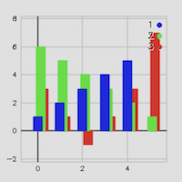
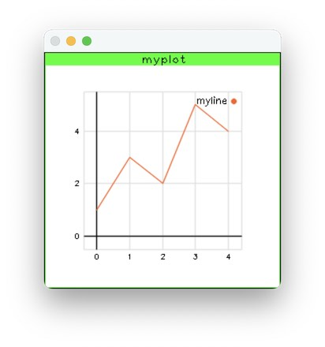
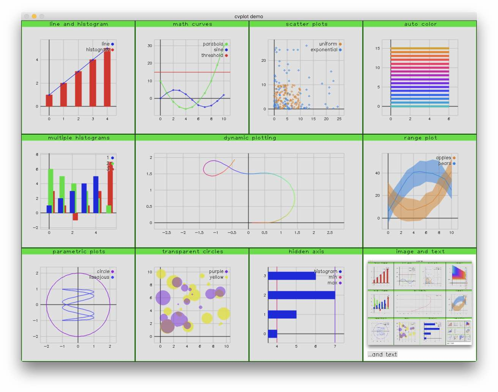

# cvplot

*Graph plots, drawing, layout and windows in OpenCV.*

## About

Yet another cvplot library? Yes. Because they're all pretty bad. Like this one.

## Build

Install the dependencies CMake and OpenCV. If you're on macOS, use Homebrew:

    brew install cmake opencv

On Ubuntu:

    apt-get install cmake libopencv-dev

Next build using CMake. The easiest way:

    make

Internally it creates a `build` folder and runs CMake from there.

This project is developed and tested on macOS and Ubuntu.

## Example

To draw a simple line graph:

    cvplot::figure("myplot").series("myline")
      .addValue({1.f, 3.f, 2.f, 5.f, 4.f});
    cvplot::figure("myplot").show();

## Features

- Graphs: line, histogram, scatter
- Time series, parametric, range
- Automatic and dynamic coloring
- Transparency
- Image and text drawing
- Sub-windows (views)
- Window and view layout
- Green view frame
- Mouse support
- OpenCV-like API (highgui)
- Distinguished dated look

## Demo

To see some of the plotting in action, run the demo:

    make demo

The style of windows and colors are intentionally pale and pixelated to give a dated feel to the whole thing.

## Test

If [googletest](https://github.com/google/googletest) is available on your system, run tests with:

    make test
