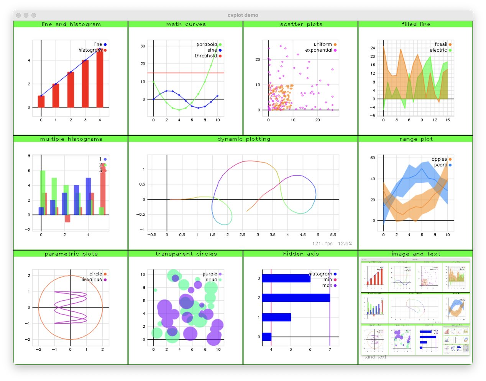

# cvplot

*Graph plots, drawing, layout and windows in OpenCV.*

## About

Yet another cvplot library? Yes. Because they're all pretty bad. Like this one.

## Build

Install the dependencies CMake and [OpenCV](https://github.com/opencv/opencv). If you're on macOS, use Homebrew:

    brew install cmake opencv

On Ubuntu:

    apt-get install cmake libopencv-dev

Next build using CMake. The easiest way:

    make

Internally it creates a `build` folder and runs CMake from there.

This project is developed and tested on macOS and Ubuntu.

## Example

To draw a simple line graph:

    cvplot::figure("myplot").series("myline")
      .addValue({1., 3., 2., 5., 4.});
    cvplot::figure("myplot").show();

## Features

- Graphs: line, histogram, scatter
- Time series, parametric, range
- Automatic and dynamic coloring
- Transparency (yes, really)
- Image and text drawing
- Sub-windows (views)
- Window and view layout
- Green view frame
- Mouse support
- OpenCV-like API (highgui)

## Demo

To see some of the plotting in action, run the demo:

    make demo

To learn more about these examples, take a look at `src/demo/demo.cc`.

## Test

Run tests with:

    make test

## Contributing

Your contributions to cvplot are welcome! cvplot is small and nimble, with lots of missing features. If you would like to see a new feature, found a bug, or wrote some new code, please don't hesitate to reach out by filing a PR or issue.

## License

MIT
